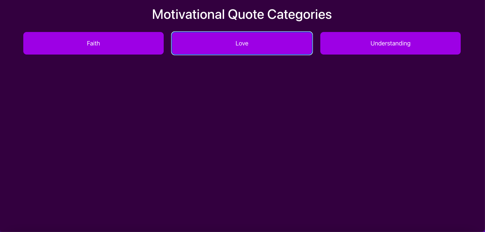
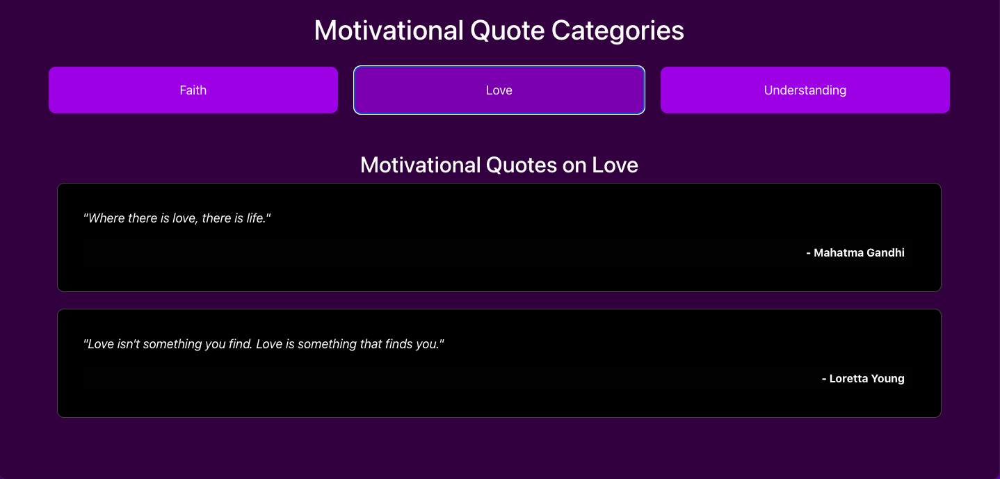

# Bible Categories App

A React and TypeScript application that allows users to browse different Bible categories and view related Bible verses. Verses are stored in a JSON file, with references and versions displayed when selected. The site is designed with Bootstrap for responsive layouts.

## Table of contents

- [Technologies](#technologies)
- [Project Structure](#project-structure)
- [Setup Instructions](#setup-instructions)
- [Screenshots](#screenshots)
- [Live Demo](#live-demo)
- [Contact](#contact)

## Technologies

- React, TypeScript, Bootstrap, CSS, and JSON.

## Project Structure

src/
├── components/
│   ├── BibleCategory.tsx        # Displays Bible categories as clickable cards
│   ├── VerseList.tsx            # Displays Bible verses for the selected category
├── pages/
│   └── HomePage.tsx             # Main page that displays categories and verses
├── data/
│   └── bibleVerses.json         # Stores Bible verses and their categories
├── types/
│   └── types.ts                 # Defines shared types, e.g., Verse interface
├── App.tsx                      # Entry point for the app
└── index.tsx                    # Renders the app into the DOM

## Setup Instructions

1. Clone the repository:

   git clone https://github.com/ibsaajadam/bible-categories

2. Navigate to the project directory:

   cd bible-categories

3. Install dependencies:

   npm install

4. Start the development server:

   npm start

   The app will now be running at http://localhost:3000.

## Screenshots

  

## Live Demo

View the live demo here: [Live Demo](https://your-demo-link.com)

## Contact

Created by [Ibsaa J Adam](https://github.com/ibsaajadam) - feel free to contact me!

You can also find me on:

- [Linkedin](https://www.linkedin.com/in/ibsaajadam/)
- [Github](https://github.com/ibsaajadam)
